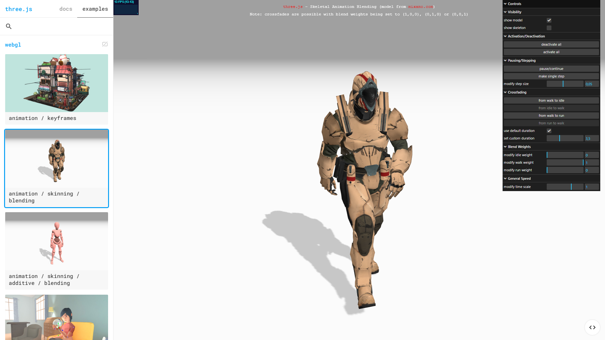

# Three.js canvas rendering with Puppeteer on GKE Autopilot without GPU

Puppeteer example with GKE Autopilot (Google Kubernetes Engine), software-rendering a Three.js canvas.
GPU on GKE is quite expensive and quite complex to set up. This example shows how to use Puppeteer to render a Three.js canvas without GPU, 
by enabling software-rendering mode on the Linux machine.

## Usage

### Try local first?

You need node.js and npm installed locally.

```
npm install puppeteer
node test.js
```

This will goto [this](https://threejs.org/examples/#webgl_animation_skinning_blending) Three.js example, wait 2 seconds to load the canvas and then take a 
screenshot `my_screenshot.png` and store it in the current directory: 



### Docker

Clean up node_modules, package.json and package-lock.json in case you have run the local example before.

```
docker build -t puppeteer-docker-three.js-gke .
docker run puppeteer-docker-three.js-gke
```

The screenshot will be stored in `/app/my_screenshot.png` inside the container.

### GKE Autopilot

The dockerimage is compatible with GKE Autopilot. There is no SYS_ADMIN needed, as you don't use hardware acceleration with this image.

Use the `kubectl cp` to download the screenshot from the GCP POD.

